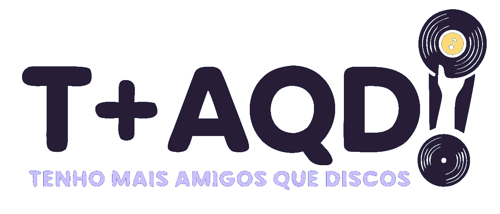

# Identidade Visual

# 🎨 Identidade Visual do Projeto

O site foi desenvolvido com uma identidade visual moderna e nostálgica, buscando representar a cultura musical dos discos físicos através de cores suaves e elementos visuais inspirados no universo vintage.

---

## 🖌️ Paleta de Cores

| Elemento       | Cor       |
| -------------- | --------- |
| Fundo          | `#F8F5FF` |
| Roxo Principal | `#7B2CBF` |
| Lilás Suave    | `#DCC9FF` |
| Rosa Destaque  | `#FF6BB5` |
| Texto Escuro   | `#2B213A` |

---

## 🎯 Conceito Visual

A proposta visual do site combina:

* Estilo moderno
* Referências retrô e vintage
* Elementos minimalistas
* Experiência visual confortável
* Cores suaves ligadas ao universo musical

O objetivo é transmitir sensação de nostalgia, calma e imersão musical.

---

## 🔤 Tipografia

### Títulos

```css
font-family: 'Poppins', sans-serif;
```

A fonte Poppins foi utilizada para títulos por possuir um visual moderno, limpo e elegante.

---

### Textos

```css
font-family: 'Inter', sans-serif;
```

A fonte Inter foi utilizada nos textos por oferecer ótima legibilidade e conforto visual.

---

## 🖼️ Logo

A logo do projeto representa a identidade musical e visual da marca “Tenho Mais Amigos Que Discos”, reforçando o conceito de cultura musical e colecionismo.

Arquivo utilizado:



```

---

## 📱 Responsividade

O design do site foi desenvolvido seguindo o conceito Mobile First, priorizando inicialmente a experiência em dispositivos móveis e posteriormente adaptando o layout para telas maiores.

---

